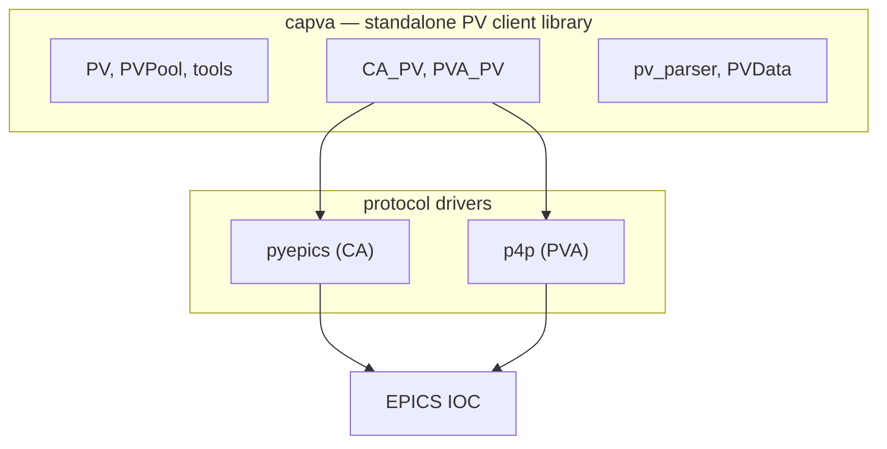

# capva

Unified Python client for EPICS PVs over **Channel Access (CA)** and **PV Access (PVA)**.

capva wraps [pyepics](https://github.com/pyepics/pyepics) and [p4p](https://github.com/epics-base/p4p) behind one API. Reads and monitors return a structured **`PVData`** model; JSON/Web payloads are built with **`PVData.to_dict()`** (optional base64 array encoding).

**Developed from the [weiss](https://github.com/weiss-controls/weiss) project** — capva builds on that codebase and refactors the PV client layer into a standalone Python library with a unified CA/PVA API and structured `PVData`.



## Features

- **Single API for CA and PVA** — One client for Channel Access and PV Access; capva picks the backend from the PV name so application code does not split into separate CA/PVA paths.
- **Unified `PVData` model** — Every read returns the same structured snapshot (value, alarm, timeStamp, display, control, …). Monitor callbacks return value, alarm, and timeStamp by default.
- **Raw monitor** — `monitor_raw()` delivers a `RawMonitorEvent` with the driver payload unchanged (no parsing in the EPICS callback thread). Parse later with `parse_raw_monitor_to_pvdata()`, `parse_raw_monitor_to_update_dict()`, or `parse_raw_monitor_to_metadata_dict()` when your application is ready (ideal for high-concurrency gateways).
- **Public parser API** — `parse_raw_monitor_to_*` helpers for deferred parsing from `RawMonitorEvent`. Lower-level CA/PVA parsers live in `capva.pv_parser`.
- **Public interfaces: `PV`, `PVPool`, and procedural tools** — Use the object API for multi-step work on one connection, `PVPool` when several callers share a PV, or one-shot `pvget` / `pvput` / `pvinfo` / `pvmonitor` / `pvmonitor_raw` when a script only needs a single operation.
- **Reference-counted `PVPool`** — `getPV` / `releasePV` reuse one connection per PV name; the channel closes when the last reference is released.
- **Protocol prefixes** — `ca://…` for Channel Access, `pva://…` for PV Access, or no prefix to default to CA.

## Requirements

- Python ≥ 3.10

## Installation

From [PyPI](https://pypi.org/project/capva/):

```bash
pip install capva
```

From a checkout (development):

```bash
pip install -e .
```

## Quick start

Examples use `pva://calcExample`; switch to `ca://…` or a bare name (CA default) as needed.

### Procedural API

```python
import time

from capva import PVData, pvget, pvmonitor

PV_NAME = "pva://calcExample"

data = pvget(PV_NAME)
print(data.value)

def on_update(data: PVData) -> None:
    if data.is_disconnected():
        print(f"{data.pvName} disconnected")
    else:
        print(data.value)

session = pvmonitor(PV_NAME, on_update)
try:
    time.sleep(30)
finally:
    session.close()
```

### Object API

```python
import time

from capva import PV, PVData

PV_NAME = "pva://calcExample"

pv = PV(PV_NAME)
handle = None
try:
    data = pv.get()
    print(data.value)

    def on_update(data: PVData) -> None:
        if data.is_disconnected():
            print(f"{data.pvName} disconnected")
        else:
            print(data.value)

    handle = pv.monitor(on_update)
    time.sleep(30)
finally:
    if handle is not None:
        pv.clear_monitor(handle)
    pv.close()
```

### Raw monitor (deferred parsing)

```python
import time

from capva import PV, RawMonitorEvent, parse_raw_monitor_to_update_dict, parse_raw_monitor_to_metadata_dict

PV_NAME = "pva://calcExample"

pending = None

def on_raw(event: RawMonitorEvent):
    global pending
    pending = event

pv = PV(PV_NAME)
handle = pv.monitor_raw(on_raw)
try:
    time.sleep(1.0)
finally:
    pv.clear_monitor(handle)
    pv.close()

if pending is not None and not pending.disconnected:
    update = parse_raw_monitor_to_update_dict(pending)
    metadata = parse_raw_monitor_to_metadata_dict(pending)
    print(update["value"], metadata.get("display"))
```

### PVPool

```python
from capva import PVPool

PV_NAME = "pva://calcExample"

pv1 = PVPool.getPV(PV_NAME)
pv2 = PVPool.getPV(PV_NAME)
try:
    print(pv1 is pv2)  # same pooled instance
    print(pv1.get().value)
finally:
    PVPool.releasePV(pv1)
    PVPool.releasePV(pv2)
```

### `PVData.to_dict` modes

| `mode` | Use case |
|--------|----------|
| `"full"` | Complete snapshot (value, alarm, timeStamp, display, control, …) |
| `"update"` | Monitor/Web push (value, alarm, timeStamp; metadata from `parse_raw_monitor_to_metadata_dict` when needed) |
| `"metadata"` | display / control / valueAlarm only |

Set `base64_encode=True` on `"full"` or `"update"` to emit `b64arr` / `b64dtype` instead of a numeric array `value`.

## Project layout

```
src/capva/
  pv.py, pv_data.py      # Public PV + PVData model
  pv_parser.py           # CA/PVA → PVData
  monitor_raw.py         # RawMonitorEvent, parse_raw_monitor_to_* helpers
  tools.py               # pvget, pvput, pvinfo, pvmonitor
  pool.py                # PVPool
  providers/             # ca_pv, pva_pv
examples/
  tool_*.py              # Procedural tools (one-shot)
  pv_*.py                # PV class API
  pool_*.py              # PVPool (shared connections)
tests/                   # Unit tests (mocked; no IOC required)
```

## Examples

Edit `PV_NAME` at the top of each script, then run against a real IOC:

```bash
# Procedural tools
python examples/tool_get.py
python examples/tool_info.py
python examples/tool_put.py
python examples/tool_monitor.py

# PV class
python examples/pv_get.py
python examples/pv_info.py
python examples/pv_put.py
python examples/pv_monitor.py
python examples/pv_monitor_raw.py

# PVPool
python examples/pool_get.py
python examples/pool_info.py
python examples/pool_put.py
python examples/pool_monitor.py

# Web JSON payload (wfExample waveform PV + Node.js)
python examples/encode_array.py
node examples/decode_array.js
```

## License

MIT — see [LICENSE](LICENSE).
